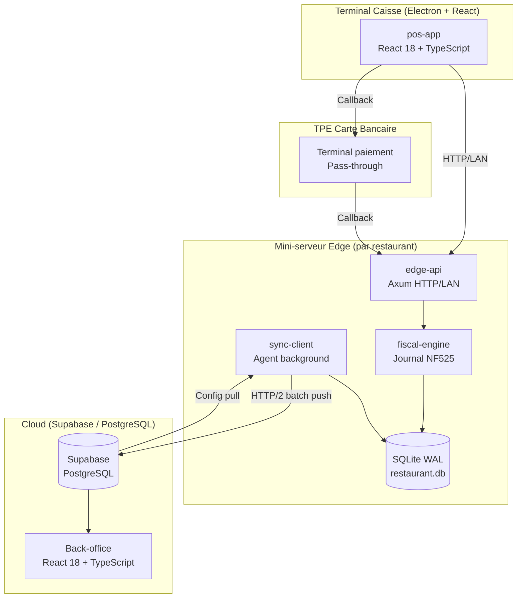
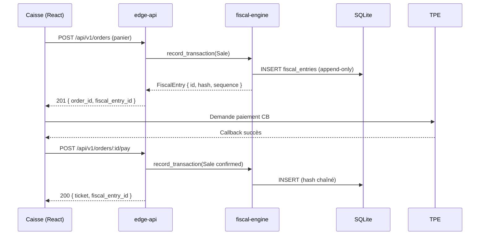
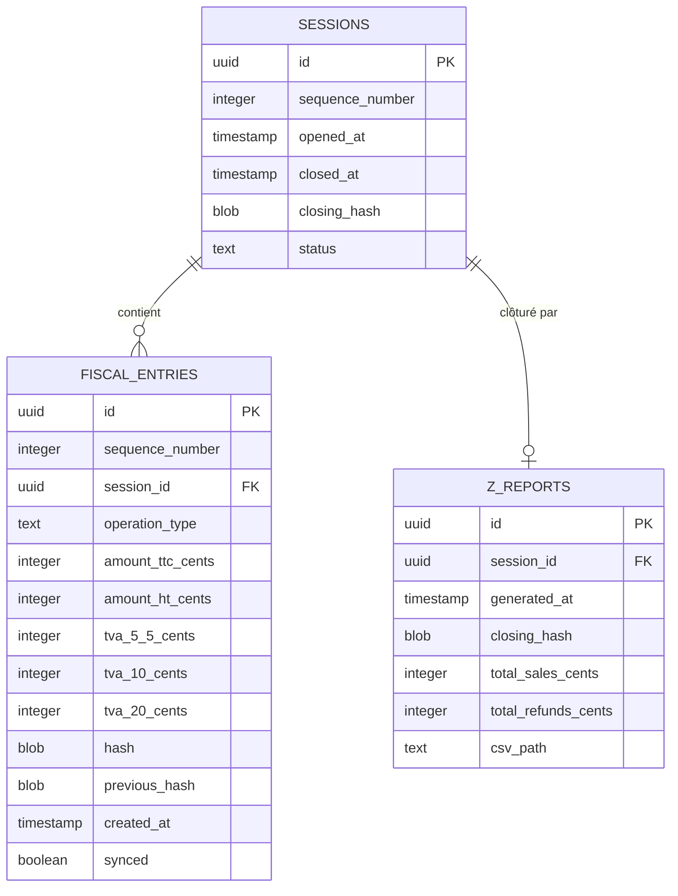

# Architecture pos-fiscal

Système de caisse enregistreuse certifiable NF525 pour chaînes de restauration rapide.
Architecture offline-first : chaque restaurant fonctionne de manière autonome.

## Diagramme général

## Flux d'une vente (chemin critique)

## Modèle de données fiscal (SQLite)

## Décisions d'architecture

| Décision | Choix | ADR |
|----------|-------|-----|
| Moteur fiscal | Rust | [ADR-001](adr/001-rust-fiscal-engine.md) |
| API edge | Axum | (ADR-002, Étape 6) |
| Base locale | SQLite WAL | (ADR-003, Étape 4) |
| Sync cloud | Supabase HTTP | (ADR-004, Étape 7) |
| Représentation monétaire | `Cents` (i64) | In-code, `common::Cents` |

## Contraintes de sécurité

- **Aucune donnée bancaire** ne transite par le système : le TPE est pass-through
- **LAN uniquement** : l'`edge-api` ne doit jamais être exposée sur Internet
- **Append-only** : le journal fiscal est en lecture seule après écriture (garanti par Rust + contraintes SQLite)
- **Synchronisation read-only sur le journal** : le `sync-client` ne modifie jamais `fiscal_entries`
